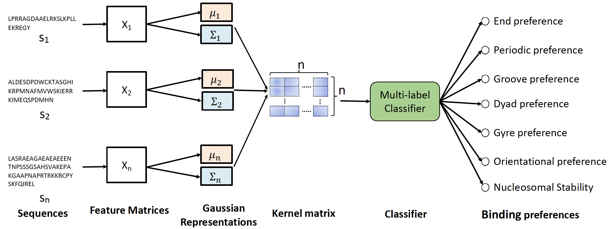

# ProtGauss README
This repository is the official implementation of `Machine learning predicts nucleosome binding modes of transcription factors`.
## Block diagram


## Requirements
The codebase is implemented in Python 3.6.9 and the packages used for developments are mentioned below.

```
argparse 		1.1
gensim			3.8.1
numpy			1.16.1
pandas			1.0.0
pickle 			4.0
prettytable		0.7.2
pyfasta			0.5.2
scikit-learn		0.23.1
texttable		1.6.2
tqdm			4.40.2
```

## Datasets
Protein sequences from UniProt (release 2019_11) is used to train ProtVec model.  To model and evaluate nucleosome-binding modes of transcription factors, we use seven nucleosome-TF interaction patters for195 TFs as our training dataset. These datasets (raw and preprocessed) are provided in `data` folder.
More details are provided inside `data` folder.
## Options
Training of ProtGauss is handled by `main.py`  which provides following arguments:
```
--seqtype	STR		Type of sequences: eDBD or full 	Default  is eDBD.
--len		INT		Length of subsequence (3, 4, 5, 6)	Default is 3.	
--binding	INT		Binding mode to use for training 	Default is 0.
```
For binding parameters, we use following mapping:
```
0 		End binding
1 		Periodic
2 		Groove
3 		Dyad
4 		Gyre spanning
5 		Oriented
6 		Nucleosome_stability
-1 		All
```


## Running ProtGauss
- Make sure you check the README in `data` folder before running the model.

- Run the model with default parameters 

```train
python3 main.py
```

- Run the model on full sequences

```train
python3 main.py --seqtype full
```

- Run the model with subsequence length 4

```train
python3 main.py --len 4
```

- Run the model with subsequence length 3 and sequence type eDBD

```train
python3 main.py --len 3 --seqtype eDBD
```

 - Run the model for specific binding modes

```train
python3 main.py --binding 0
```


 - Run the model for all binding modes

```train
python3 main.py --binding -1
```

\

## Results
Tables reporting model's performance are saved inside `results` folder with naming convention as:
`{binding_mode}_{subsequence_length}.csv`.

For example,
```train
python3 main.py --binding 0 --seqtype eDBD --len 3
``` 
The results will be saved inside `results/eDBD/` as `end_preference_3.csv`.

## Predictions
Model's prediction for test sequences in folder `data/yeast/` will be saved in the same folder. 
Note that the folder name should be set in line 63 of `main.py` as `organism =['yeast']`. 
You can run the model and predict on multiple sequences by defining `organism =['ecoli', 'yeast']`.
   
For example, if we train the model with `organism =['yeast']` in line 63 of `main.py`,
```train
python3 main.py --binding 0 --seqtype eDBD --len 3
``` 
The predictions will be saved inside `data/yeast/` as `yeast_prediction_eDBD3.csv`. 
The name for prediction file is set as `{organism}_prediction_{sequence_type}{subsequence_length}.csv`. 
